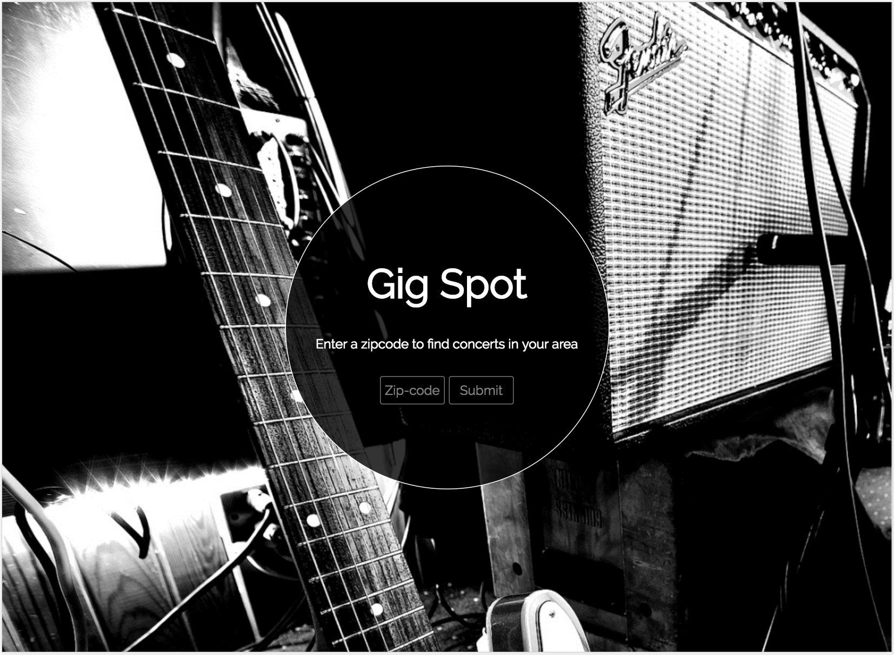
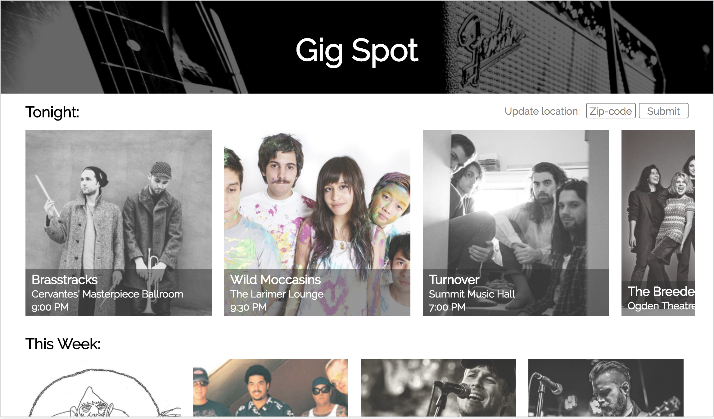
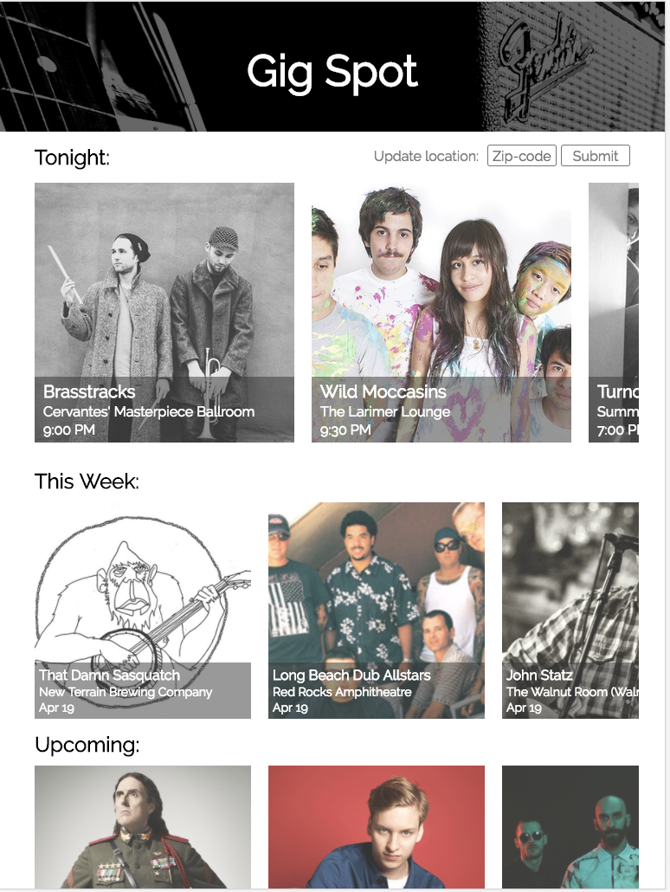
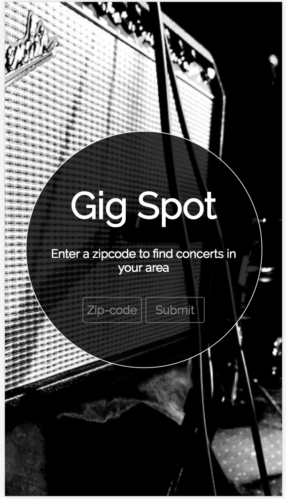
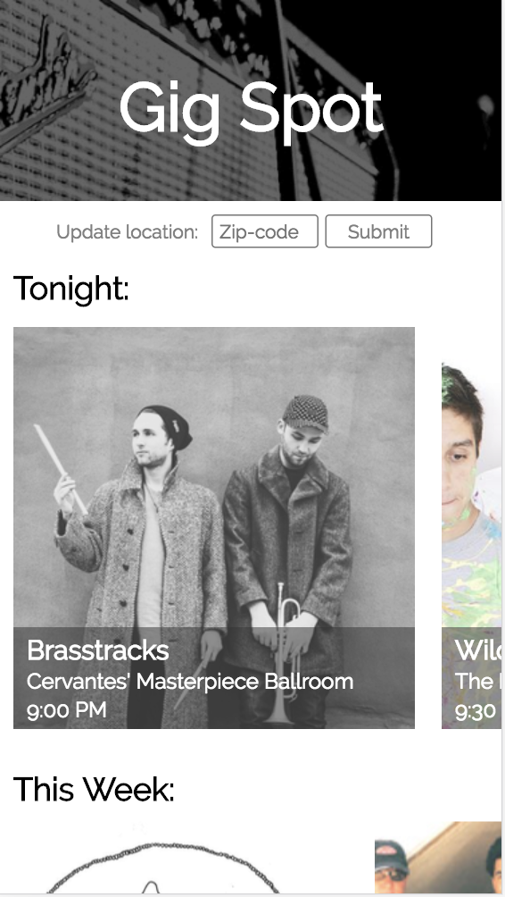
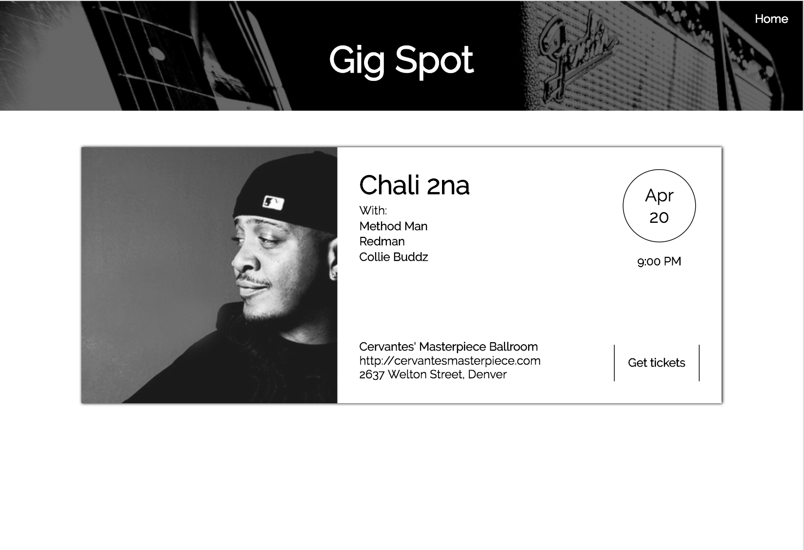

# Gig Spot

#### View the deployed site || https://gigspot.surge.sh/

## Synopsis

#### Gig Spot is an application that is focused on finding concerts in your area. It was designed to give a special focus to concerts that are happening today and this week. This project was built using React, React-Router, Redux and used Jest and Enzyme for testing. The concert data is pulled from the Eventful API and the artist images are from the Last FM API.

## Project Guidelines

## Installation

#### This project was bootstrapped with create-react-app

#### Clone down the repo

#### `git clone https://github.com/jaredeklin/gig-spot`

#### `npm install`

#### `npm start`

## API

#### Eventful || http://api.eventful.com/

#### Last FM || https://www.last.fm/api

## Tests

#### This project was developed using using Jest and Enzyme testing utilities. To run the test suites for this project:

#### `npm test`

## Contributors

Jared Eklin || https://github.com/jaredeklin

## Project Layout

#### Landing page

#### Desktop layout

#### Ipad layout

#### Mobile landing page

#### Mobile layout

#### Event detail layout

